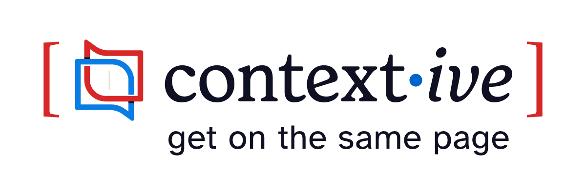

# Contextive

<picture>
  <source media="(prefers-color-scheme: dark)" srcset="images/logo-tagline-inverted.png">
  <source media="(prefers-color-scheme: light)" srcset="images/logo-tagline.png">
  
</picture>

    

Contextive is a suite of tools to immerse developers in the language of their users' domains.

## Inspiration

Contextive is inspired by the concept of the [Ubiquitous Language](https://martinfowler.com/bliki/UbiquitousLanguage.html) from the practice of [Domain Driven Design (DDD)](https://martinfowler.com/bliki/DomainDrivenDesign.html) and is intended to support ubiquitous language management practices on DDD projects.

Even if you're not using Domain Driven Design, Contextive should still be very helpful in any software project where it's important that developers are aligned on the meaning of terms.

By defining terms in a central glossary file, Contextive can surface definitions and usage examples in auto-complete suggestions & hover panels wherever the terms are used - in code (of any language across the stack), comments, config, and documentation (e.g. markdown).

Interview introducing Contextive at NDC Sydney 2024:

[Other Videos referencing Contextive](https://docs.contextive.tech/ide/background/videos/)

## Installation

See our [Installation Guide](https://docs.contextive.tech/ide/guides/installation/) for details on how to install in a few different IDEs, or any IDE that supports the Language Server Protocol.

Officially supported IDEs include:

#### [VsCode](https://docs.contextive.tech/ide/guides/installation/#visual-studio-code)
#### [IntelliJ IDEs](https://docs.contextive.tech/ide/guides/installation/#intellij-plugin-platform)
#### [Visual Studio](https://docs.contextive.tech/ide/guides/installation/#visual-studio-2022)
#### [Neovim](https://docs.contextive.tech/ide/guides/installation/#neovim)
#### [Helix](https://docs.contextive.tech/ide/guides/installation/#helix)

## Configuration & Usage

See our [Usage Guide](https://docs.contextive.tech/ide/guides/usage/) for details on configuring Contextive, setting up your glossary file, and the various features and options available to you in defining your domain-specific terminology.

## Features

The following list is a rough and evolving backlog/roadmap.  Checked items are completed, others are not a commitment, just ideas that have been suggested.

* [ ] Ubiquitous Language Definition & Storage:
  * [ ] Classify terms as aggregates/entities, attributes, commands and events
  * [x] For each term, include a definition, and examples of usage in normal sentences
  * [ ] Link terms to each other (e.g. commands to the aggregates/entities they apply to; events to the aggregates/entities that publish them)
  * [ ] Define relationships between contexts (e.g. a Context Map definition)
  * [x] Store Ubiquitous Language glossary in a file in the repository (e.g. yml format)
  * [x] Repository Layouts:
    * [x] Support a monorepo with multiple Bounded Contexts in one repo - identify which paths relate to each Bounded Context
    * [x] Support a Bounded Context distributed across multiple repos ([#36](https://github.com/dev-cycles/contextive/issues/36))
  * [x] Support aliases of terms, hovering over the alias shows the term definition
  * [x] Add details of the alias in the hover
  * [ ] Add ability to define an alias as deprecated and warn as such
  * [x] Support multiline domain vision statements, definitions and usage examples
* [ ] IDE Support
  * [x] [Visual Studio Code](#vscode)
    * [x] Support single-root workspaces
    * [x] Support multi-root workspaces with a shared glossary file
    * [ ] Support multi-root workspaces with a glossary file per root
  * [x] [IntelliJ IDEs](#intellij-ides)
    * [x] [Most IntelliJ Platform IDEs](https://plugins.jetbrains.com/docs/intellij/language-server-protocol.html#supported-ides)
    * [ ] Rider - limited support, see [#65](https://github.com/dev-cycles/contextive/issues/65)
  * [x] [Visual Studio (2019/2022)](#visual-studio)
  * [ ] Eclipse
  * [ ] NetBeans
  * [x] [neovim](#neovim)
  * [x] [helix](#helix)
  * [ ] emacs
* [ ] Code-editing Features
  * [x] Show the term definitions & usage examples when hovering over the word in the editor 
    * [x] Also when the word being hovered over is plural of the defined singular term
    * [ ] Also when the word being hovered over is singular of the defined plural term
    * [ ] Also when the combined word being hovered over is contains singular or plural of a word in a defined multi-word term
  * [x] Add Ubiquitous Language terms to the auto-complete list
  * [ ] Codelens to identify the number of Ubiquitous Language terms in a method or class
  * [ ] Problems/warnings if misuse of the Ubiquitous Language - e.g. use of Command/Event and aggregate in the same class or method name when they are not linked, or use of extra words next to an Aggregate that _isn't_ defined
  * [ ] In relevant places (e.g. hover), note the use of the term in other contexts to highlight the contrast and ensure clarity of which definition applies in the current context (e.g. '_THIS_ definition, _NOT_ that other definition that you might have been thinking of')
* [ ] Ubiquitous Language Management Features
  * [ ] Go To term definition (right-click menu, keyboard shortcut)
  * [ ] A UI widget to view the language terms in a TreeView and offer facilities for adding, updating & removing terms
  * [ ] Make it easy to add terms to the Ubiquitous Language from existing code e.g. by highlighting and using the right-click menu
* [ ] Ubiquitous Language Sharing Features
  * [ ] Render definitions into a human readable format - e.g. html, markdown etc.
  * [ ] Sync definitions into a cloud storage, e.g. Notion database, or confluence page
  * [ ] Above features might be well packaged as a CLI as well as extension features, for running in CI/CD

## Contributing

See [CONTRIBUTING](./CONTRIBUTING.md) for details.

## License

This project is licensed under the [MIT](https://choosealicense.com/licenses/mit/) license.  See [LICENSE](LICENSE).
