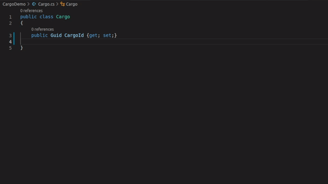
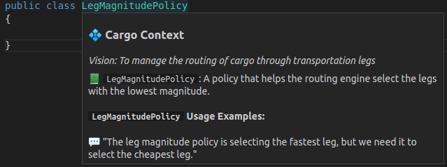
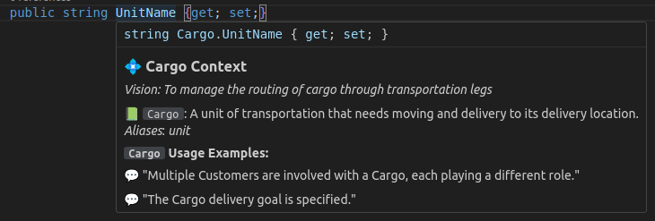
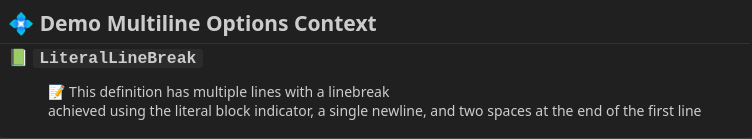
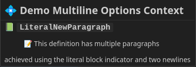
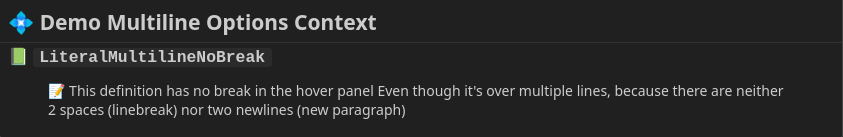

This page will help you learn how to define your language in a Contextive glossary.

## Example Domain

In the following sections, examples are drawn from the Cargo domain, as explored by [Eric Evans](https://twitter.com/ericevans0) in his seminal work on DDD - [Domain Driven Design: Tackling Complexity in the Heart of Software](https://www.dddcommunity.org/book/evans_2003/).

The usage examples are quoted or inspired by sample conversations in the book - ideally, your usage examples should be exact sentences as said by your domain experts.

The following Contextive Glossary file was used to generate all screenshots/scenarios below:

```
contexts:
  - name: Cargo
    domainVisionStatement: To manage the routing of cargo through transportation legs
    paths:
    - CargoDemo
    terms:
    - name: Cargo
      definition: A unit of transportation that needs moving and delivery to its delivery location.
      examples:
        - Multiple Customers are involved with a Cargo, each playing a different role.
        - The Cargo delivery goal is specified.
      aliases:
        - unit
    - name: Leg
      definition: The movement of a Cargo on a specific vessel from load location to unload location.
      examples:
        - Operations will need to contract handling work based on the expected times for each leg
        - For each leg we'd like to see the vessel voyage, the load and unload location, and time.
    - name: Policy
      definition: |
        A set of rules that the routing service must follow
        when evaluating legs that confirm to the desired routing specification.
      examples:
        - We need to configure the set of policies that will apply for a specific customer.
    - name: Leg Magnitude Policy
      definition: A policy that helps the routing engine select the legs with the lowest magnitude.
      examples:
        - The leg magnitude policy is selecting the fastest leg, but we need it to select the cheapest leg.
    - name: Vessel
  - name: Billing
    domainVisionStatement: Compute and levy charges for shipping
    paths:
    - BillingDemo
    terms:
    - name: Policy
      definition: A set of payment rules that defines when invoices are due, and actions to take when unpaid.
      examples:
        - The billing policy is to send to collections after 90 days in arrears.
```

The screenshots are from VsCode, but it should look similar in any IDE.

## Combined Words

When working out what to show you in a hover panel, Contextive is able to identify the use of multiple defined terms in combined words when terms are combined using `camelCase`, `PascalCase`, `snake_case` or `kebab-case`.

### Suffixes and Prefixes

It's quite common to combine a term from your language, such as `cargo` with a suffix such as `Id` (or `service`, or `factory`, etc.).  If your code includes `cargoId`, `CargoId` or `cargo_id`, Contextive will identify the defined term `cargo` and display the definition and usage examples:


### Combining two (or more) terms

It's also common to end up with code elements (classes, variables or methods) that combine two or more terms from your language, such as `Leg` and `Policy`.  Even if you haven't explicitly created a term for `LegPolicy`, Contextive will identify both words and show you both definitions at the same time:



### Multi-word terms

Sometimes, the combined term needs its own unique definition - just add it to your glossary file, and Contextive will work out that the more precise match is the one you want, decluttering your hover panel.  

It can be added to your glossary file in a few different ways.  Consider a case where we alread have definitions for `Leg` and `Policy` but we want a special definition for `Leg Magnitude Policy`.  You can specify it in your glossary file in a number of ways:

* `Leg Magnitude Policy` (Recommended - natural language)
* `LegMagnitudePolicy` (PascalCase)
* `legMagnitudePolicy` (camelCase)
* `leg_magnitude_policy` (snake_case)
* `leg-magnitude-policy` (kebab-case)

:::tip[Recommendation]
We recommend defining multi-word terms in your glossary file in natural language:

`Leg Magnitude Policy`

The other options are supported as many folk are migrating from documentation systems which must match the exact usage of the terms in code.
:::

However it's it's defined, the definitions of `Leg` and `Policy` will not be shown and only the 'multi-word' term will be shown.

As with all combined words, it will be shown when hovering over text that matches any of the supported word combination techniques: `camelCase`, `PascalCase`, `snake_case` or `kebab-case`.




## Plural Words

Contextive can detect a defined term even when it is defined in the singular and used in the plural.

Coming Soon: Ability to detect a defined term when it is defined in the plural and used in the singular, and when individual words in a multi-word term are pluralised or singularised.

## Term Aliases

Contextive supports defining a list of aliases for a given term.  These can be acronyms or just alternative words that are sometimes used interchangeably.  For example, in the cargo domain above, `unit` is an alias of `cargo`.

When hovering over the word `unit`, the definition of `cargo` will be displayed:



## Multiline YAML

As some of the fields in the glossary file could have long text, it may be helpful to use multi-line yaml. Because the fields are interpreted as markdown, there are some special considerations to be aware of.  The site https://yaml-multiline.info/ is a great resource for multi-line yaml fields.

import Link from '../../../components/VersionedLink.astro';

The following common scenarios are more fully explored in the <Link href="https://github.com/dev-cycles/contextive/blob/v{frontmatter.contextive_version}/src/vscode/contextive/test/single-root/fixtures/simple_workspace/.contextive/multiline.yml">multiline sample file</Link> and apply to all fields, but are most likely useful for the `domainVisionStatement`, `terms.definition` and `terms.examples` fields.

### Multiline with Line Break

If a definition (or domain vision statement) is quite long, and you would like to include linebreaks (but not new paragraphs), you need to use one of the yaml multi-line options that ensures at least one newline is parsed, AND to render a markdown linebreak you need to add two `<SPACE>` characters at the end of the line:

```yaml
contexts:
  - name: Demo Multiline Options
    terms:
      - name: LiteralLineBreak
        definition: |
          This definition has multiple lines with a linebreak  
          achieved using the literal block indicator, a single newline, and two spaces at the end of the first line
```

Renders to:



### Multiline with New Paragraph

To achieve a new paragraph, use a yaml option that parses multiple newlines, e.g.:

```yaml
contexts:
  - name: Demo Multiline Options
    terms:
      - name: LiteralNewParagraph
        definition: |
          This definition has multiple paragraphs

          achieved using the literal block indicator and two newlines
```

Renders to:



### Multiline in No Newline in Hover

Sometimes you may want to break over multiple lines to make it easier to read the raw yaml, but don't want the newlines to appear in the hover.  In this case, just don't use any Markdown linebreak or new para features.  e.g.:

```yaml
contexts:
  - name: Demo Multiline Options
      - name: LiteralMultilineNoBreak
        definition: |
          This definition has no break in the hover panel
          Even though it's over multiple lines, because there are neither 2 spaces (linebreak) nor two newlines (new paragraph)
```

Renders to:



The line will still wrap according to the width of the hover panel.

## Smart Auto-Complete

As the terms added to the auto-complete are from a glossary file, not from your code symbols, the auto-complete will work in any file of any language - including documentation, such as markdown.

To ensure it's useful in a variety of scenarios, it includes a number of options to fit your required format:

* camelCase
* PascalCase
* snake_case
* UPPER_CASE
* kebab-case

The auto-complete options will adjust as you type:

* After typing a single lower-case letter, only `camelCase`, `snake_case` & `kebab-case` will be included.
* After typing a single upper case letter, `PascalCase` and `UPPER_CASE` will be included.
* After typing two upper case letters, single word, snake_case and combined words will all be in `UPPERCASE`.
* After typing any case letters and an underscore, only `snake_case` will be included.
* After typing only lower case letters and a `-`, only `kebab-case` will be included.

