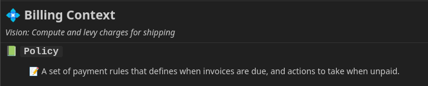

This page explains how to define your language in a Contextive glossary.

## Example Domain

In the following sections, examples are drawn from the Cargo domain, as explored by [Eric Evans](https://twitter.com/ericevans0) in his seminal work on DDD - [Domain Driven Design: Tackling Complexity in the Heart of Software](https://www.dddcommunity.org/book/evans_2003/).

The usage examples are quoted or inspired by sample conversations in the book - ideally, your usage examples should be exact sentences as said by your domain experts.

The following Contextive Glossary files were used to generate all screenshots/scenarios below:

```yml title="repo-root/cargo-module/cargo.glossary.yml"
contexts:
  - name: Cargo
    domainVisionStatement: To manage the routing of cargo through transportation legs
    meta:
      "👥 Owner:": "[Team A](https://corporate.wiki/teams/TeamA)"
    terms:
    - name: Cargo
      definition: A unit of transportation that needs moving and delivery to its delivery location.
      examples:
        - Multiple Customers are involved with a Cargo, each playing a different role.
        - The Cargo delivery goal is specified.
      aliases:
        - unit
      meta:
          "🌐 Ref:": "[Cargo Wiki](https://corporate.wiki/glossary/cargo)"
          ✅: Approved
    - name: Leg
      definition: The movement of a Cargo on a specific vessel from load location to unload location.
      examples:
        - Operations will need to contract handling work based on the expected times for each leg
        - For each leg we'd like to see the vessel voyage, the load and unload location, and time.
    - name: Policy
      definition: |
        A set of rules that the routing service must follow
        when evaluating legs that confirm to the desired routing specification.
      examples:
        - We need to configure the set of policies that will apply for a specific customer.
    - name: Leg Magnitude Policy
      definition: A policy that helps the routing engine select the legs with the lowest magnitude.
      examples:
        - The leg magnitude policy is selecting the fastest leg, but we need it to select the cheapest leg.
    - name: Vessel
```

```yml title="repo-root/billing-module/billing.glossary.yml"
contexts:
  - name: Billing
    domainVisionStatement: Compute and levy charges for shipping
    terms:
    - name: Policy
      definition: A set of payment rules that defines when invoices are due, and actions to take when unpaid.
      examples:
        - The billing policy is to send to collections after 90 days in arrears.
```

The screenshots are from VsCode, but it should look similar in any IDE.

## Simple Terms

A simple term can be defined with just the name of the term:

```diff lang="yml" title="repo-root/billing-module/billing.glossary.yml"
...
    - terms:
+      - name: Policy
```


The _undefined_ definition is there to prompt adding a definition.

The `name` field is the only **required** field.

### Definition

By adding a definition field, the hover panel becomes more useful:

```diff lang="yml" title="repo-root/billing-module/billing.glossary.yml"
...
    - terms:
      - name: Policy
+        definition: A set of payment rules that defines when invoices are due, and actions to take when unpaid.
```



### Usage Examples

Usage examples are a list of statements that represent real sentences that might be said be people working in the domain.  If provided, these are included in the hover panel to help contextualise the definitions.

To define usage examples, provide the `examples` key, like so:

```diff lang="yml" title="repo-root/billing-module/billing.glossary.yml"
...
    - terms:
      - name: Policy
        definition: A set of payment rules that defines when invoices are due, and actions to take when unpaid.
+        examples:
+          - The billing policy is to send to collections after 90 days in arrears.
```


### Aliases

Contextive supports defining a list of aliases for a given term.  These can be acronyms or just alternative words that are sometimes used interchangeably.  For example, in the cargo domain above, `unit` is an alias of `cargo`.

```diff lang="yml" title="repo-root/billing-module/billing.glossary.yml"
...
    - terms:
      - name: Policy
        definition: A set of payment rules that defines when invoices are due, and actions to take when unpaid.
        examples:
          - The billing policy is to send to collections after 90 days in arrears.
+        aliases:
+          - Rule
```

When hovering over the word `Rule`, the definition of `Policy` will be displayed:


### Metadata

Sometimes teams have extra data they'd like to display with the term, such as a link to a resource that might explain it in more detail, or some governance characteristics.

These can be stored in the `meta` key, and will be shown underneath the definition. Both key and value can contain markdown or emoji. If you want a `:` after the key, you must add it to the text of the key as it will not be added.

For example:

```diff lang="yml" title="repo-root/billing-module/billing.glossary.yml"
...
    - terms:
      - name: Policy
        definition: A set of payment rules that defines when invoices are due, and actions to take when unpaid.
        examples:
          - The billing policy is to send to collections after 90 days in arrears.
        aliases:
          - Rule
+        meta:
+          "🌐 Ref:": "[Policy Wiki](https://corporate.wiki/glossary/policy)"
+          ✅: Approved
```


## Finding Words in Code

Often terms from your glossary are used in code as part of compound word, such as `PolicyEntity`, `PolicyId` or `policy_service`.

These kind of compound words are supported when compounding is done with any of:

* `camelCase`
* `PascalCase`
* `snake_case`
* `kebab-case`

This section describes some common patterns that make use of this.

### Suffixes and Prefixes

It's quite common to combine a term from your language, such as `cargo` with a suffix such as `Id` (or `service`, or `factory`, etc.).  If your code includes `cargoId`, `CargoId` or `cargo_id`, Contextive will identify the defined term `cargo` and display the definition and usage examples:


### Unicode and Diacritics

Many languages have letters with diacritics, e.g. `ö`, `è` or `ç`.  If the ubiquitous language term is defined in the natural language of the domain, it would be best to define terms using those diacritics.

However, in source code, it is common to not use the diacritic, and indeed in German, to substitute the diacritic with an `e`, e.g. `ö` -> `oe`.  German has another character, `ß` which is not commonly used in source code, and is instead replaced with `ss`.

Contextive supports all these cases.  For example, the following table shows the source code text options that will cause a definition of a defined Term to be shown.

<table>
    <thead>
        <tr>
            <th>Defined Term</th>
            <th>Source Code</th>
        </tr>
    </thead>
    <tbody>
        <tr>
            <td>Äpfel</td>
            <td>
```
äpfel
aepfel
apfel
```
            </td>           
        </tr>     
        <tr>
            <td>Père</td>
            <td>
```
père
pere
```
            </td>           
        </tr>
        <tr>
            <td>Straße</td>
            <td>
```
straße
strasse
``` 
            </td>           
        </tr>
    </tbody>
</table>

### Combining two (or more) terms

It's also common to end up with code elements (classes, variables or methods) that combine two or more terms from your language, such as `Leg` and `Policy`.  Even if you haven't explicitly created a term for `LegPolicy`, Contextive will identify both words and show you both definitions at the same time:

```diff lang="yml" title="repo-root/cargo-module/cargo.glossary.yml"
...
+    - name: Leg
      definition: The movement of a Cargo on a specific vessel from load location to unload location.
      examples:
        - Operations will need to contract handling work based on the expected times for each leg
        - For each leg we'd like to see the vessel voyage, the load and unload location, and time.
+    - name: Policy
      definition: |
        A set of rules that the routing service must follow
        when evaluating legs that confirm to the desired routing specification.
      examples:
        - We need to configure the set of policies that will apply for a specific customer.
```


### Complex (multi-word) terms

For terms that are phrases or compound words, just add it to your glossary file like a normal term.

Even if the individual words are also defined as terms themselves, when hovering over code that matches the phrase or compound word, Contextive will work out that the more precise term is the one you want.  

Multi-word terms can be added to your glossary file in a few different ways.  Consider a case where we alread have definitions for `Leg` and `Policy` but we want a special definition for `Leg Magnitude Policy`.  You can specify it in your glossary file using any of these patterns:

* `Leg Magnitude Policy` (Recommended - natural language)
* `LegMagnitudePolicy` (PascalCase)
* `legMagnitudePolicy` (camelCase)
* `leg_magnitude_policy` (snake_case)
* `leg-magnitude-policy` (kebab-case)

:::tip[Recommendation]
We recommend defining multi-word terms in your glossary file in natural language, e.g.:

```diff lang="yml" title="repo-root/cargo-module/cargo.glossary.yml"
...
+    - name: Leg Magnitude Policy
      definition: A policy that helps the routing engine select the legs with the lowest magnitude.
      examples:
        - The leg magnitude policy is selecting the fastest leg, but we need it to select the cheapest leg.
```

The other options are supported to help folk migrating from documentation systems which must match the exact usage of the terms in code.
:::

However it is defined in the glossary, the definitions of `Leg` and `Policy` will not be shown and only the 'multi-word' term will be shown.


As with all combined words, it will be shown when hovering over text that matches any of the supported word combination techniques: `camelCase`, `PascalCase`, `snake_case` or `kebab-case`.

### Plurals

Contextive can detect a defined term even when it is defined in the singular and used in the plural.  In this example, even though defined as `Policy` the term is still shown when hovering over `PoliciesCollection`.

```diff lang="yml" title="repo-root/billing-module/billing.glossary.yml"
...
    - terms:
      - name: Policy
        definition: A set of payment rules that defines when invoices are due, and actions to take when unpaid.
```


Coming Soon: Ability to detect a defined term when it is defined in the plural and used in the singular, and when individual words in a multi-word term are pluralised or singularised.

## Smart Auto-Complete

As the terms added to the auto-complete are from a glossary file, not from your code symbols, the auto-complete will work in any file of any language - including documentation, such as markdown.

To ensure it's useful in a variety of scenarios, it includes a number of options to fit your required format:

* camelCase
* PascalCase
* snake_case
* UPPER_CASE

The auto-complete options will adjust as you type:

* After typing a single lower-case letter, only `camelCase` & `snake_case` will be included.
* After typing a single upper case letter, `PascalCase` and `UPPER_CASE` will be included.
* After typing two upper case letters, single word, snake_case and combined words will all be in `UPPERCASE`.
* After typing any case letters and an underscore, only `snake_case` will be included.


## Multiline YAML

As some of the fields in the glossary file could have long text, it may be helpful to use multi-line yaml. Because the fields are interpreted as markdown, there are some special considerations to be aware of.  The site https://yaml-multiline.info/ is a great resource for multi-line yaml fields.

import Link from '../../../components/VersionedLink.astro';

The following common scenarios are more fully explored in the <Link href="https://github.com/dev-cycles/contextive/blob/{frontmatter.contextive_version}/src/vscode/contextive/test/single-root/fixtures/simple_workspace/.contextive/multiline.yml">multiline sample file</Link> and apply to all fields, but are most likely useful for the `domainVisionStatement`, `terms.definition` and `terms.examples` fields.

### Multiline with Line Break

If a definition (or domain vision statement) is quite long, and you would like to include linebreaks (but not new paragraphs), you need to use one of the yaml multi-line options that ensures at least one newline is parsed, AND to render a markdown linebreak you need to add two `<SPACE>` characters at the end of the line:

```diff lang="yml" title="linebreak-demo.glossary.yml"
contexts:
  - name: Demo Multiline Options
    terms:
      - name: LiteralLineBreak
        definition: |
+          This definition has multiple lines with a linebreak  
+          achieved using the literal block indicator, a single newline, and two spaces at the end of the first line
```

:::danger[Note:]
There is an issue with the website rendering which is stripping the critical trailing two spaces at the end of the first line of the definition. Do not copy paste this example and expect it to work.

In the <Link href="https://github.com/dev-cycles/contextive/blob/{frontmatter.contextive_version}/docs/web/src/content/docs/guides/defining-terminology.mdx?plain=1#L285">original source</Link> it _does_ have two spaces after `linebreak`
:::

Renders to:


### Multiline with New Paragraph

To achieve a new paragraph, use a yaml option that parses multiple newlines, e.g.:

```diff lang="yml" title="linebreak-demo.glossary.yml"
contexts:
  - name: Demo Multiline Options
    terms:
      - name: LiteralNewParagraph
        definition: |
+          This definition has multiple paragraphs
+
+          achieved using the literal block indicator and two newlines
```

Renders to:


### Multiline in No Newline in Hover

Sometimes you may want to break over multiple lines to make it easier to read the raw yaml, but don't want the newlines to appear in the hover.  In this case, just don't use any Markdown linebreak or new para features.  e.g.:

```diff lang="yml" title="linebreak-demo.glossary.yml"
contexts:
  - name: Demo Multiline Options
      - name: LiteralMultilineNoBreak
        definition: |
+          This definition has no break in the hover panel
+          Even though it's over multiple lines, because there are neither 2 spaces (linebreak) nor two newlines (new paragraph)
```

Renders to:


The line will still wrap according to the width of the hover panel.