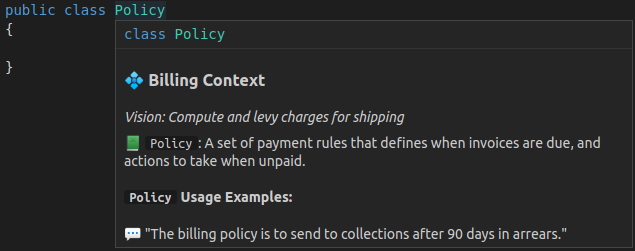

## Repository Layout

Contextive is designed to work with a variety of repository organisation schemes:

### Single Bounded Context, Multiple Repositories

When a single context is comprised of services, each with their own repository, it's not ideal to have to maintain a copy of the context's glossary in each repository.

To facilitate this pattern, Contextive recommends storing the terms only once, in a central/common repository, and using native package management facilities to distribute the glossary file as part of any common code packages.

For package managers that store the packages within the workspace, simply set `contextive.path` to the relative path of the downloaded package.  For package managers that store the packages in a global cache, Contextive allows the `contextive.path` setting to contain a shell escape code - `$(cmd)`. When `$(` is detected in the path setting, Contextive will execute `echo "%contextive.path%"` and use the result to `stdout` as the location of the glossary file.

See https://github.com/dev-cycles/contextive-demo-go-service for an example of this in action using `golang` packages.


### Multiple Bounded Contexts, Repository per Context

This is the simplest option - all you need to do is define the terms for that context in the relevant repository.

### Multiple Bounded Contexts, Single Repository, Single-Root (Monorepo)

For projects utilising a [monorepo](https://en.wikipedia.org/wiki/Monorepo) it's not uncommon to have code relating to multiple [bounded contexts](https://martinfowler.com/bliki/BoundedContext.html) in the same repository.  At this time, Contextive tracks all definitions in the same file.  Each context has a `paths` property that defines a list of path [globs](https://en.wikipedia.org/wiki/Glob_(programming)).  When working on a file, any context with a matching path glob will be evaluated when finding matches for hover and auto-complete.

This is particularly helpful if the same term (e.g. a common term, like `client`, or `invoice`) is used in multiple contexts.  The definition in each context can relate specifically to its usage in that context.

Each context has optional properties `name` and `domainVisionStatement`.  When set, these names and vision statements will be included in the hover panel.

Given the glossary file above, and a folder structure like so:

```
/CargoDemo
  /LegPolicy.cs
/BillingDemo
  /Policy.cs
```

Contextive will match the files to the path glob configurations.

When hovering over `CargoDemo/LegPolicy.cs` we get:


When hovering over `BillingDemo/Policy.cs` we get:



### Multiple Bounded Contexts, Multi-Root, Shared glossary file

Some IDEs support a [multi-root workspace](https://microsoft.github.io/language-server-protocol/specifications/lsp/3.17/specification/#workspace_workspaceFolders) configuration which allows separate folders to be selected as 'roots' of a workspace. 

So far, Contextive only supports this under ALL the following circumstances:

1. You are using the VsCode IDE in a [Multi-Root](https://code.visualstudio.com/docs/editor/multi-root-workspaces) configuration AND
2. The definitions/terminology for all roots are in a shared file (Support for separate files per root is a future enhancement) AND
3. The value for the `contextive.path` configuration parameter is explicitly provided in the `settings` key of the `.code-workspaces` file  

The reason is that the Contextive glossary file location defaults to the relative path `.contextive/definitions.yml`.  This default is defined in the language server (to ensure consistency across IDEs). In a single-root configuration it's clear what base path it is relative to, but with multi-root it's ambiguous as to which root the path is relative to.

To resolve this, custom VsCode middleware rewrites the setting to an absolute path computed relative to the folder of the `.code-workspaces`, however this only works if VsCode is aware of the setting value to be re-written.

:::caution[Breaking Change] 
In the initial support for multi-root workspaces, the default value was defined in the VsCode extension, so the path rewrite worked on this default value and an explicit setting was not required.

With the removal of the vscode default value, this no longer works and an explicit value is required in the `settings` key in the `.code-workspaces` file.

If you are using the default location, please set this value to `.contextive/definitions.yml`, e.g. your `.code-workspaces` file should have:

```
{
   "settings": {
     "contextive.path": ".contextive/definitions.yml"
   }  
}
```
:::

Also note that the `paths` key in the Contextive glossary file relates to the paths of the roots on disk, not to their names in the vscode multi-root configuration.

If you'd like to store the glossary file in a different location, update the setting in the `.code-workspaces` file.

If you need multi-root support in another IDE, please raise a [github issue](https://github.com/dev-cycles/contextive/issues/new?assignees=&labels=&projects=&template=feature_request.md&title=)!
