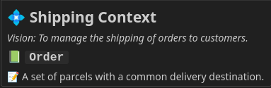

import { FileTree } from '@astrojs/starlight/components';

Glossaries are files that contain lists of terms, their definitions and other attributes.

For Contextive to find your glossary file, it must match the pattern `*.glossary.yml`. You can name the prefix whatever you like, so `project.glossary.yml` and `module.glossary.yml` are both valid filenames, but `module-glossary.yml` is not.

## Glossary Location

The first thing to decide is how many of these files you need and where to put them.

:::tip
Terms in a glossary file are used by Contextive when working on any file in the same folder as the glossary or any of its child folders.
:::

The following sections explore common patterns for where to place your glossary files.

### Terms useful in a whole repository

If the terms in a file are useful for all files in the repository, then you should put the glossary file in the root.

<FileTree>

- repository
  - projectName.glossary.yml a glossary relevant for the whole repository
  - README.md
  - frontend
    - components
      - SubmitOrder.ts
  - backend
    - domain
      - Order.cs

</FileTree>

In the example above, if `projectName.glossary.yml` contains a definition for the term `Order`, then that definition will be used when editing `README.md`, `frontend\Components\SubmitOrder.ts` and `backend\domain\Order.cs`.

### Different terms relevant in different repositories

This is fundamentally the same as the previous pattern, but is described to be explicit for teams who are using multiple repositories.

For this approach to work, each repository must deal with different domain concepts so that the terms useful in one repository are irrelevant in the others, and visa versa.

This pattern is particularly useful if each repository aligns with the concept of a [Bounded Context](#bounded-contexts) from Domain-Driven Design.

<FileTree>

- shipping-repository
  - shipping.glossary.yml a glossary relevant only in the shipping repo
  - src
    - Order.cs
- ...
- payments-repository
  - payments.glossary.yml a glossary relevant only in the payments repo
  - src
    - Order.cs

</FileTree>

In this case, `shipping.glossary.yml` might define `Order` as `A set of parcels with a common delivery destination.`.  This definition will be shown when working on in the `shipping` repository.

`payments.glossary.yml` might define `Order` as ``An amount to be charged to the customer and the payment method to charge``.  This definition will be shown when working in the `payments` repository.

### Terms are useful only in a subfolder of the repository

If the terms in a file are useful only in a subfolder, put the glossary file in the top-most folder that encompasses those relevant files.

For example, if you are building a 'modular monolith' in a monorepo, you might have your modules in separate folders, in which case you should put definitions relevant to each module in that module's folder, like so:

<FileTree>

- repository
  - README.md
  - shipping
    - shipping.glossary.yml a glossary relevant only in the shipping repo
    - src
      - Order.cs
  - payments
    - payments.glossary.yml a glossary relevant only in the payments repo
    - src
      - Order.cs

</FileTree>

Assuming the same definitions as before, where `shipping.glossary.yml` defines `Order` as `A set of parcels with a common delivery destination.` and `payments.glossary.yml` defines `Order` as `An amount to be charged to the customer and the payment method to charge.`, then:

* When working on `/shipping/src/Order.cs`, hovering over the word `Order` will show `A set of parcels with a common delivery destination.`
* When working on `/payments/src/Order.cs`, hovering over the word `Order` will show `An amount to be charged to the customer and the payment method to charge.`

This pattern is particularly useful if the modules in your modular monolith align with the concept of a [Bounded Context](#bounded-contexts) from Domain-Driven Design.

### Terms are useful across multiple repositories

If you have multiple repositories that would benefit from access to the same terms, then it's recommended to define the terms in one repository and to construct a system for copying them into the other repositories.

:::tip[Coming Soon]
A forthcoming update to Contextive will let you 'import' your glossary from a remote URL, which will make this pattern much simpler. Stay tuned!
:::

## Bounded Contexts

In Domain-Driven Design, a Bounded Context is a logical boundary around a model of some portion of the domain. It's quite common for different Bounded Contexts to evolve their own unique 'languages' or 'dialects'.

### Defining a Bounded Context

The top level of the yml file is a list of bounded contexts with the key contexts. A file with a single context looks like:

```yml
contexts:
  - name: Shipping
    domainVisionStatement: To manage the shipping of orders to customers.
    terms:
      - %list of terms%
```
Both the `name` and `domainVisionStatement` are optional, but if supplied, they will be shown at the top of the hover panel to provide context for the terms.



If those fields are undefined, the context can be as simple as:

```yml
contexts:
  - terms:
    - %list of terms%
```

Which would just show the term definition:


See [defining terminology](../defining-terminology) for details on defining terms.

Following the patterns above, it is recommended to have a single context per file, but [multiple contexts per file](#multiple-bounded-contexts) is supported.

### Multiple Bounded Contexts

:::caution
This feature is available for backwards compatibility reasons, but is not recommended.  See above for recommended patterns.
:::

Early versions of Contextive used a single glossary file with all contexts in it, and for backwards compatibility reasons, this is still supported.

To scope the context to a particular portion of the repository, as described in [Terms are useful only in a subfolder of the repository](#terms-are-useful-only-in-a-subfolder-of-the-repository), then each context can have a list of path globs supplied and the terms in that context will only be shown for files that match the path glob.

For example, to achieve the same outcome, you could have a structure like:

<FileTree>

- repository
  - project.glossary.yml a glossary with all contexts and terms
  - README.md
  - shipping
    - src
      - Order.cs
  - payments
    - src
      - Order.cs

</FileTree>

And the contexts could be defined like so:

```yml
contexts:
  - name: Shipping
    domainVisionStatement: To manage the shipping of orders to customers.
    paths:
    - shipping
    terms:
      - % list of terms in the shipping context
  - name: Payments
    domainVisionStatement: To manage handling payments, refunds & financial reconciliations for orders.
    paths:
    - payments
    terms:
      - * list of terms in the payments context
```
