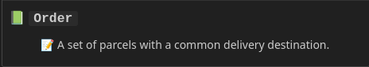

import { FileTree } from '@astrojs/starlight/components';

Glossaries are files that contain lists of terms, their definitions and other attributes. You can have as many glossary files as you like in your repository.

For Contextive to find a glossary file, it must match the pattern `*.glossary.yml`. You can name the prefix whatever you like, so `project.glossary.yml` and `module.glossary.yml` are both valid filenames, but `module-glossary.yml` is not.

When setting up a glossary file, there are two things to do:

1. Define a bounded context in the header of the glossary - see [Bounded Contexts](#bounded-contexts)
2. Decide where to put the glossary file - this affects which files are supported by its terminology - see [Glossary Location](#glossary-location)

## Bounded Contexts

In Domain-Driven Design, a Bounded Context is a logical boundary around a model of some portion of the domain. It's quite common for different Bounded Contexts to evolve their own unique 'languages' or 'dialects', so it is helpful to keep them in separate glossary files.

### A Simple Bounded Context

The top level of the `*.glossary.yml` file is a list of bounded contexts. The key in the yml file is `contexts`. A file with a single context looks like:

```yml
// shipping.glossary.yml
contexts:
  - name: Shipping
    terms:
      - name: Order
        definition: A set of parcels with a common delivery destination.
      - % other terms %
...
```


The `name` field is optional, but generally recommended.

### Defining a Domain Vision Statement

`domainVisionStatement` is an optional field that allows you to express the purpose of the context.

```yml
// shipping.glossary.yml
contexts:
  - name: Shipping
    domainVisionStatement: To manage the shipping of orders to customers.
    terms:
      - name: Order
        definition: A set of parcels with a common delivery destination.
      - % other terms %
...
```


### Context Metadata

Contexts can have a `meta` key which allows defining an arbitrary set of key:value pairs.  The value must be a string, and they are rendered exactly as supplied with a space between them.

Both the key and the value support markdown, which can allow for hyperlinks out to more thorough documentation, e.g.:

```yml
// shipping.glossary.yml
contexts:
  - name: Shipping
    domainVisionStatement: To manage the shipping of orders to customers.
    meta:
      "👥 Owner:": "[Team A](https://corporate.wiki/teams/TeamA)"
      "🌐 Ref:": "[Cargo Canonical Reference](https://corporate.wiki/glossary/shipping)"
    terms:
      - name: Order
        definition: A set of parcels with a common delivery destination.
      - % other terms %
...
```


### No Context definition

All three fields - `name`, `domainVisionStatement` and `meta` are optional.  If none are undefined, the context can be as simple as:

```yml
// shipping.glossary.yml
contexts:
  - terms:
      - name: Order
        definition: A set of parcels with a common delivery destination.
      - % other terms %
...
```

Which would just show the term definition:



See [defining terminology](../defining-terminology) for details on defining terms.

### Glossary File Template

import Link from '../../../components/VersionedLink.astro';

When getting started, it could be helpful to copy the <Link href="https://github.com/dev-cycles/contextive/blob/{frontmatter.contextive_version}/src/language-server/Contextive.LanguageServer.Tests/E2e/GlossaryFileInitializationTests.Default%20Glossary%20File.verified.txt">default glossary file template</Link> which contains all possible fields and is used to define the terms used in the glossary file itself.

It can be used as a starting point to edit and amend to incorporate your contexts and [define your terms](../defining-terminology/).

## Glossary Location

The following sections explore common patterns for where to place your glossary files.

:::tip
Terms in a glossary file are used by Contextive when working on any file in the same folder as the glossary or any of its child folders.

If you need terms from another glossary file, the [import](#terms-defined-in-an-external-data-source) facility may assist.
:::

### Terms relevant for the whole repository

If the terms in a file are useful for all files in the repository, then you should put the glossary file in the root.

<FileTree>

- repository
  - projectName.glossary.yml &lt;-- a glossary for the **whole repository**
  - README.md
  - frontend
    - components
      - SubmitOrder.ts
  - backend
    - domain
      - Order.cs

</FileTree>

In the example above, if `projectName.glossary.yml` contains a definition for the term `Order`, then that definition will be used when editing `README.md`, `frontend\Components\SubmitOrder.ts` and `backend\domain\Order.cs`.

### Different terms relevant in different repositories

This is the same as the previous pattern, but is described to be explicit for teams who are using multiple repositories.

For this approach to work, each repository must deal with different domain concepts so that the terms useful in one repository are irrelevant in the others, and visa versa.

This pattern is particularly useful if each repository contains all the code associated with a [Bounded Context](#bounded-contexts).

<FileTree>

- shipping-repository
  - shipping.glossary.yml &lt;-- a glossary only for **shipping**
  - src
    - Order.cs
- ...
- payments-repository
  - payments.glossary.yml &lt;-- a glossary only for **payments**
  - src
    - Order.cs

</FileTree>

In this case, `shipping.glossary.yml` might define `Order` as `A set of parcels with a common delivery destination.`.  This definition will be shown when working on in the `shipping` repository.

`payments.glossary.yml` might define `Order` as `An amount to be charged to the customer and the payment method to charge.`.  This definition will be shown when working in the `payments` repository.

### Terms relevant only in a subfolder of the repository

If the terms in a file are useful only in a subfolder, put the glossary file in the top-most folder that encompasses those relevant files.

For example, if you are building a 'modular monolith' in a monorepo, you might have your modules in separate folders, in which case you should put definitions relevant to each module in that module's folder, like so:

<FileTree>

- repository
  - README.md
  - shipping
    - shipping.glossary.yml &lt;-- a glossary only for **shipping**
    - src
      - Order.cs
  - payments
    - payments.glossary.yml &lt;-- a glossary only for **payments**
    - src
      - Order.cs

</FileTree>

Assuming the same definitions as before, where `shipping.glossary.yml` defines `Order` as `A set of parcels with a common delivery destination.` and `payments.glossary.yml` defines `Order` as `An amount to be charged to the customer and the payment method to charge.`, then:

* When working on `/shipping/src/Order.cs`, hovering over the word `Order` will show `A set of parcels with a common delivery destination.`
* When working on `/payments/src/Order.cs`, hovering over the word `Order` will show `An amount to be charged to the customer and the payment method to charge.`

This pattern is particularly useful if each module in your modular monolith contains all the code associated with a [Bounded Context](#bounded-contexts).

### Terms defined in an external data source

Some organisations already have their terms defined in an existing dataset and do not want to maintain them separately in a repository.

For this purpose, you can create a glossary that _imports_ from a remote URL.  The contents of the remote URL are then treated as though they were available at the position in the folder structure of the _importing_ file.

:::note
You will need to build your own processes (manual or automated) to extract the terminology definitions from the external dataset and map them to a Contextive glossary yml files and then arrange to host those files.
:::

<FileTree>

- repository
  - README.md
  - shipping
    - shipping.glossary.yml &lt;-- will import from a remote URL
    - src
      - Order.cs
  - payments
    - payments.glossary.yml
    - src
      - Order.cs

</FileTree>

```yml title="shipping/shipping.glossary.yml"
imports:
  - "https://your.domain/path/to/shipping.glossary.yml"
```

With this configuration, any terminology contained in the file located at `https://your.domain/path/to/shipping.glossary.yml` will be made available as though it had been defined in `shipping/shipping.glossary.yml`.

Multiple glossary files may be imported into the same location by defining a list of imports.

```diff lang="yml" title="shipping/shipping.glossary.yml"
imports:
  - "https://your.domain/path/to/shipping.glossary.yml"
+  - "https://your.domain/path/to/other.glossary.yml"
```

:::caution
Remote glossary files are loaded at startup and changes are not automatically detected. To force a refresh, 'touch' the _importing_ file by saving it (with or without changes) or restart the IDE.
:::

:::danger
Contextive does not support accessing authenticated remote URLs.  If it's important that your glossaries remain private, at this point it's best to try and protect them by hosting them in locations only available on a corporate LAN/VPN or restrict access to them via a proxy.
:::

### Terms relevant in multiple folder locations

Sometimes even though bounded contexts have different languages and are neatly separated, it's helpful to have access to terms from another context in some parts of the code - consider code that deals with integration between the contexts.

In this case, the integration folder can contain a glossary file that imports another glossary file from a local absolute or relative path:
<FileTree>

- repository
  - README.md
  - shipping
    - shipping.glossary.yml
    - src
      - Order.cs
      - antiCorruptionLayer
        - payments-import.glossary.yml &lt;-- will import from the payments glossary
        - HandleOrderPaymentReceived.cs
  - payments
    - payments.glossary.yml
    - src
      - Order.cs

</FileTree>

```yml title="shipping/src/antiCorruptionLayer/payments-import.glossary.yml"
imports:
  - "../../../payments/payments.glossary.yml"
```

This will ensure that when working on `HandleOrderPaymentReceived.cs` all the terms defined in `shipping.glossary.yml` AND `payments.glossary.yml` will be available, with clear delineation between contexts, even when the same word has different meanings in each context:


When working on `shipping/src/Order.cs`, only the definition from `shipping.glossary.yml` will be shown, and when working on `payments/src/Order.cs` only the definition from `payments.glossary.yml` will be shown.

:::caution
Just like remote glossary files, local imports are loaded at startup and are not reloaded even when the _imported_ file changes. Only a change to the _importing_ file will trigger a reload.  To force a refresh, 'touch' the _importing_ file by saving it (with or without changes).
:::

#### Combining Imports with Terminology

A glossary file can contain a list of imports _as well_ as contexts and terms - they will all be made available when working in the folder, e.g.:

```diff lang="yml" title="shipping/src/antiCorruptionLayer/payments-import.glossary.yml"
imports:
  - "../../../payments/payments.glossary.yml"
+ contexts:
+  - name: Shipping Anti-corruption Layer
+    terms:
+      - name: Shipping Fee
```

In this case the `Shipping Fee` is a term that is relevant when integrating between `payments` and `shipping`, but note that it is part of a separate Context - importing a file does not merge the contexts, rather, it acts as though all contexts were defined in the same file.

### Terms relevant across multiple repositories

Some organisations have adopted a distributed repository configuration, where small services (microservices, or cloud FAAS functions) are each located in their own repositories. Often in these cases, the code in these repositories share a domain language.

If you have multiple repositories that would benefit from access to the same terms, then it's recommended to define the terms in one repository and publish them to a publicly accessibly URL.

You can then use the [imports](#terms-defined-in-an-external-data-source) feature in the other repositories and provide the URL that you have publishd your glossary file to.

:::tip
Some git repositories offer a 'raw' URL, e.g. github as a `raw.githubusercontent.com` domain - the following URL provides raw access to one of Contextive's internal glossaries used for testing:

```
https://raw.githubusercontent.com/dev-cycles/contextive/refs/heads/main/src/language-server/Contextive.LanguageServer.Tests/fixtures/import_tests/imported_folder/imported.glossary.yml
```
:::

### Multi-root workspaces

Some IDEs (e.g. VsCode) support multi-root workspaces. 

Contextive will use glossary files based on their location on disk relative to the files that are being edited and will not consider the multi-root structure.

However, it will only discover glossaries by searching from each of the roots, so depending on the disk layout of the roots, terms may or may not be used across multiple roots.

In this approach, it's recommended to use something like [Terms relevant only in a subfolder of the repository](#terms-relevant-only-in-a-subfolder-of-the-repository), where each subfolder is 'root' in the multi-root workspace.


### Multiple Bounded Contexts in a Glossary File

:::caution
This feature is available for backwards compatibility reasons, but is not recommended.  See above for recommended patterns.

It might also make sense if you are importing definitions from another source and it is simpler for you to generate a single file from your data source.
:::

Early versions of Contextive used a single glossary file with all contexts in it, and for backwards compatibility reasons, this is still supported.

To scope the context to a particular portion of the repository, as described in [Terms relevant only in a subfolder of the repository](#terms-relevant-only-in-a-subfolder-of-the-repository), then each context can have a list of path globs supplied and the terms in that context will only be shown for files that match the path glob.

For example, to achieve the same outcome, you could have a structure like:

<FileTree>

- repository
  - project.glossary.yml a glossary with all contexts and terms
  - README.md
  - shipping
    - src
      - Order.cs
  - payments
    - src
      - Order.cs

</FileTree>

And the contexts could be defined like so:

```yml {5-6} {11-12}
// project.glossary.yml
contexts:
  - name: Shipping
    domainVisionStatement: To manage the shipping of orders to customers.
    paths:
    - shipping
    terms:
      - % list of terms in the shipping context
  - name: Payments
    domainVisionStatement: To manage handling payments, refunds & financial reconciliations for orders.
    paths:
    - payments
    terms:
      - * list of terms in the payments context
```
