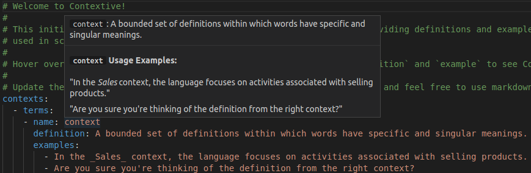

# Contextive README

 

Contextive is a Visual Studio Code extension to assist developers in environments with a complex & domain- or project-specific language, where words have a special meaning in the context of the project.

It should help new team members get up to speed more quickly in understanding domain-specific terms. By storing the term definitions in your repository, and surfacing the definitions as you work on the code, it encourages regularly updating the definitions as the team's understanding evolves.

## Getting Started

Use the `Contextive: Initialize Definitions` command from the command palette to create a sample definitions file.  This sample file illustrates the use of Contextive by defining the terms used in the definitions file yml structure.  You can hover over the name of the terms in the file to see Contextive in action (see the sample image above).

You should delete the sample definitions and replace them with your own.

## Philosophy

Contextive is inspired by the concept of the [Ubiquitous Language](https://martinfowler.com/bliki/UbiquitousLanguage.html) from the practice of [Domain Driven Design (DDD)](https://martinfowler.com/bliki/DomainDrivenDesign.html) and should support ubiquitous language management practices on DDD projects.

Even if you're not using Domain Driven Design, Contextive should still be very helpful in any software project where it's important that developers are aligned on the meaning of terms.

## Features

* Initialize your Contextive Definitions
* Auto-complete from your Contextive Definitions
* Hover to show definitions from your Contextive Definitions
* Currently configured to work in files of type: c, cpp, csharp, fsharp, go, groovy, html, java, javascript, javascriptreact, json, jsonc, markdown, perl, php, plaintext, powershell, python, ruby, rust, sql, typescript, typescriptreact, vb, xml, yaml
* Support for word identification in combined usage such as camelCase, PascalCase and snake_case
* Support for documenting combined words (e.g. verbNoun or noun_verbed)

### Combined Words

For the hover display, Contextive is able to identify the use of defined terms in combined words - where terms are combined using `camelCase`, `PascalCase` or `snake_case`.

After identifying the combined word, it is split into the individual words and any words that are defined in the `definitions.yml` file are included in the hover display.

The exception to this is if there is a defined term that matches the whole combined word - in this case, only the combined word's definition is included in the hover.

#### Examples:

A few examples to illustrate:

##### EntityId

Consider a definitions list including the term `entity`.  If your code includes `entityId`, `EntityId` or `entity_id`, Contextive will identify the word `entity` and display the defined definition and usage examples:

##### ParentChild as a combined term

Consider a definitions list including the terms `parent` and `child`.  If your code includes `parentChild`, `ParentChild` or `parent_child` (or the reverse), Contextive will identify the words `parent` and `child` and display the defined definitions and usage examples for both words:

##### ParentChild as a single term

Consider a definitions list including the terms `parent` and `child` and `parentChild`.  If your code includes `parentChild`, or `ParentChild` Contextive will identify that the token `parentChild` is an exact match for a defined term, and display ONLY the definitions and usage examples for `parentChild`.  It's assumed that the supplied definition will be more precise and accurate for this usage of the combined word.

#### Limitations

Both of these limitations will be handled in a future updated:

1. If you have a defined term `entityChild` but your code includes `entity_child`, Contextive does not yet recognise this is a match.
1. If you have a defined term `entityChild`, and your code includes `entityChildId`, Contextive will not recognise the match as it splits `entityChildId` into `entity`, `Child` and `Id` and none of them match the defined term `entityChild`, and `entityChildId` is not an exact match for the defined term. 

#### Coming Soon

* UI to edit/manage Contextive Definitions
* Show definitions in auto-complete details
* Internationalization support
* Support for multiple contexts in the same or separate repos
* Configurable list of language identifiers. The list is currently hard coded as above.
* Better support for key word identification in different languages (e.g. different syntax delimiters)
* Support for detecting plural or singular versions of terms
* Enhanced support for combined words, as noted above.

## Extension Settings

This extension contributes the following settings:

* `contextive.path`: The path of the file that stores the Contextive definitions.  Default: `.contextive/definitions.yml`

## Known Issues

* The extension only activates on the presence of the `.contextive` folder in the workspace.  If the `contextive.path` setting has been updated, the `.contextive` folder may not exist.  (The extension will also activate on use of the `Contextive: Initialize Definitions` command.)