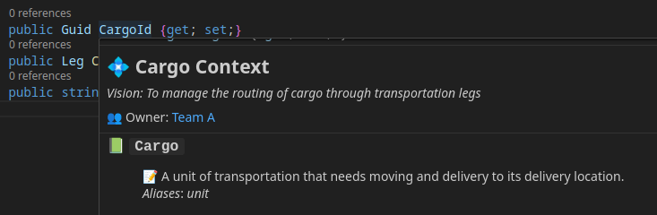

# Contextive README

    

[📘 Documentation](https://docs.contextive.tech/community/v/1.17.1/) | [🚀 Releases](https://github.com/dev-cycles/contextive/releases) | [✉️ Subscribe for Updates](https://buttondown.com/contextive)

Contextive is a Visual Studio Code extension to assist developers in environments with a complex domain or project specific language, where words have a special meaning in the context of the project.

It should help new team members get up to speed more quickly in understanding domain-specific terms. By storing the glossary in your repository, and surfacing the definitions as you work on the code, it encourages the use of the domain-specific terms in your code, and regularly updating the definitions as the team's understanding evolves.

## Installation

See [VsCode Installation Instructions](https://docs.contextive.tech/community/v/1.17.1/guides/installation/#visual-studio-code).

## Getting Started

See [setting up glossaries](https://docs.contextive.tech/community/v/1.17.1/guides/setting-up-glossaries/) and [defining terminology](https://docs.contextive.tech/community/v/1.17.1/guides/defining-terminology/) usage guides for details on getting started with Contextive.

## Features

* Initialize your Contextive Glossary
* [Auto-complete](https://docs.contextive.tech/community/v/1.17.1/guides/defining-terminology/#smart-auto-complete) from your Contextive Glossary
  * Shows definitions in auto-complete details
* Hover to show definitions from your Contextive Glossary
  * Hover over elements with [suffixes & prefixes](https://docs.contextive.tech/community/v/1.17.1/guides/defining-terminology/#suffixes-and-prefixes)
  * Hover over usage of [multiple terms](https://docs.contextive.tech/community/v/1.17.1/guides/defining-terminology/#combining-two-or-more-terms) combined using camelCase, PascalCase and snake_case
  * Hover over [multi-word](https://docs.contextive.tech/community/v/1.17.1/guides/defining-terminology/#complex-multi-word-terms) terms
  * Hover over [plural](https://docs.contextive.tech/community/v/1.17.1/guides/defining-terminology/#plurals) of defined terms
  * Hover over [aliases](https://docs.contextive.tech/community/v/1.17.1/guides/defining-terminology/#aliases) of defined terms
* Put your glossaries near the code they support:
  * [Terms relevant for the whole repository](https://docs.contextive.tech/community/v/1.17.1/guides/setting-up-glossaries/#terms-relevant-for-the-whole-repository)
  * [Different terms relevant in different repositories](https://docs.contextive.tech/community/v/1.17.1/guides/setting-up-glossaries/#different-terms-relevant-in-different-repositories)
  * [Terms relevant only in a subfolder of the repository](https://docs.contextive.tech/community/v/1.17.1/guides/setting-up-glossaries/#terms-relevant-only-in-a-subfolder-of-the-repository)
  * [Multi-root workspaces](https://docs.contextive.tech/community/v/1.17.1/guides/setting-up-glossaries/#multi-root-workspaces)
* Works in all files (uses the `*` document selector)

### Coming Soon

* UI to edit/manage Contextive Glossary
* Internationalization support
* Support for multiple contexts in separate repositories
* Better support for key word identification in different languages (e.g. different syntax delimiters)

## Extension Settings

This extension contributes the following settings:

* `contextive.path`: The path of the file that stores the Contextive glossary.  Default: `.contextive/definitions.yml`

## Known Issues

* The extension only activates on the presence of the `.contextive` folder in the workspace.  If the `contextive.path` setting has been updated, the `.contextive` folder may not exist.  (The extension will also activate on use of the `Contextive: Initialize Glossary File` command.)